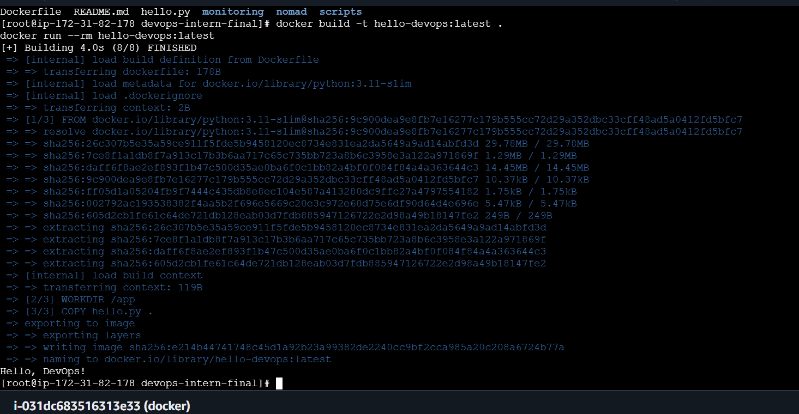

# DevOps Intern Final Assessment

**Name:** Krishnakanthula Shivamani
**Date:** 20 August 2026

## Project Description

This repository is a small, end-to-end DevOps pipeline built as a final
assessment project. It walks through Git/GitHub basics, Linux scripting,
Docker containerization, CI/CD with GitHub Actions, job scheduling with
HashiCorp Nomad, and log monitoring with Grafana Loki — with each step
producing output the next step depends on.


---

## 1. Git & GitHub Setup

Repo initialized with this README and a sample script (`hello.py`) that
prints `Hello, DevOps!`.

```bash
python hello.py
```

---

## 2. Linux & Scripting Basics

`scripts/sysinfo.sh` prints the current user, current date, and disk usage.

Run it:

```bash
chmod +x scripts/sysinfo.sh
./scripts/sysinfo.sh
```

---

## 3. Docker Basics

`Dockerfile` containerizes `hello.py` using a slim Python 3.11 base image.

Build and run:

```bash
docker build -t hello-devops:latest .
docker run --rm hello-devops:latest
```

Expected output:

```
Hello, DevOps!
```




---

## 4. CI/CD with GitHub Actions

`.github/workflows/ci.yml` runs `python hello.py` automatically on every
push and pull request to `main`. Status badge is at the top of this
README.

---

## 5. Job Deployment with Nomad

`nomad/hello.nomad` runs the `hello-devops:latest` Docker image as a
Nomad service job with minimal resources (100 MHz CPU, 128 MB memory).

Run it (assumes a local Nomad dev agent and Docker driver):

```bash
# start a local dev agent in one terminal
sudo nomad agent -dev

# build the image so the local docker driver can find it
docker build -t hello-devops:latest .

# submit the job in another terminal
nomad job run nomad/hello.nomad

# check status / logs
nomad job status hello
nomad alloc logs <alloc-id>
```

---

## 6. Monitoring with Grafana Loki

Loki + Grafana were run locally via Docker to collect and view container
logs. Full setup, the log-forwarding command, and the query used to view
logs are documented in [`monitoring/loki_setup.txt`](monitoring/loki_setup.txt).

Quick start:

```bash
docker network create loki-net
docker run -d --name loki --network loki-net -p 3100:3100 grafana/loki:2.9.0 -config.file=/etc/loki/local-config.yaml
docker run -d --name grafana --network loki-net -p 3000:3000 grafana/grafana:latest
```

Then open Grafana at `http://localhost:3000`, add Loki (`http://loki:3100`)
as a data source, and query `{job="hello-devops"}` in Explore.

*(Screenshot: Grafana Explore view showing `Hello, DevOps!` log line —
add to `monitoring/` and link here.)*

---

## 7. Extra Credit (Optional)

Not implemented in this submission. Potential next steps: add
`mlflow/` with a dummy experiment run, or a `vm/` folder documenting a
VirtualBox VM running the same Docker/Nomad job.

---

## Repository Structure

```


devops-intern-final/
├── README.md
├── hello.py
├── Dockerfile
├── scripts/
│   └── sysinfo.sh
├── .github/
│   └── workflows/
│       └── ci.yml
├── nomad/
│   └── hello.nomad
└── monitoring/
    └── loki_setup.txt
```
